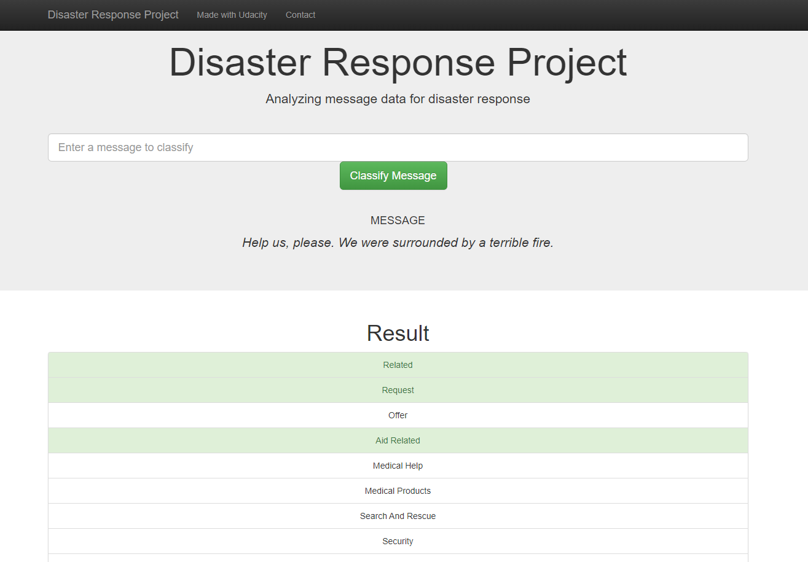
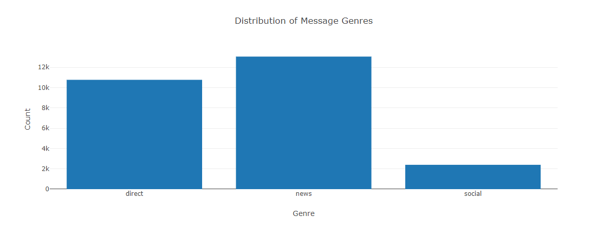
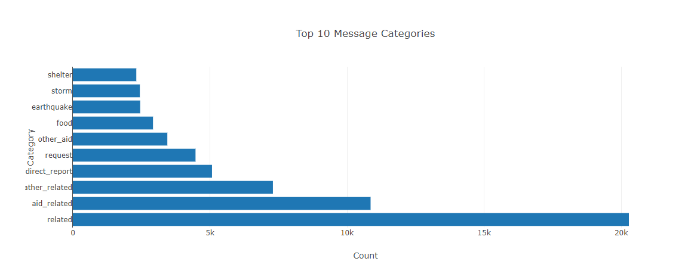
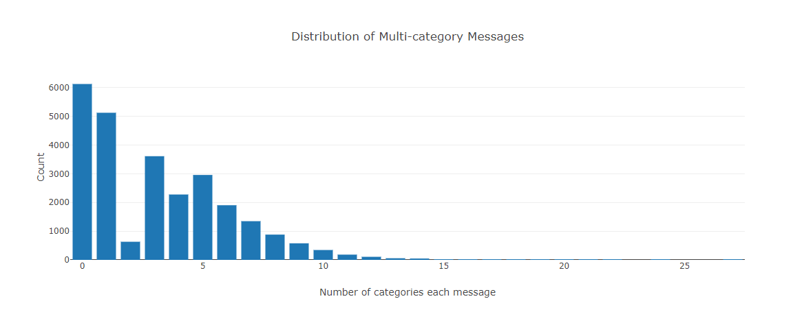

# Disaster Response Pipeline Project

## Table of Contents

1. [Instructions](#instructions)
2. [Project Motivation](#motivation)
3. [File Descriptions](#files)
4. [Results](#results)
5. [Licensing, Authors, and Acknowledgements](#licensing)

## Instructions 

1. Before getting started, you should install Python 3 and some following packages:

- pandas
- sqlalchemy
- nltk
- sklearn
- plotly
- flask

2. Run the following commands in the project's root directory to set up your database and model.

    - To run ETL pipeline that cleans data and stores in database\
        `python data/process_data.py data/disaster_messages.csv data/disaster_categories.csv data/DisasterResponse.db`
    - To run ML pipeline that trains classifier and saves\
        `python models/train_classifier.py data/DisasterResponse.db models/classifier.pkl`

2. Go to `app` directory: `cd app`

3. Run your web app: `python run.py`

4. Click the `PREVIEW` button to open the homepage

## Project Motivation

In this project, I apply data engineering skills to analyze disaster data from [Appen](https://appen.com/) (formally Figure 8) to build a model for an API that classifies disaster messages.

The data set containing real messages that were sent during disaster events. I created a machine learning pipeline to categorize these events so that I can send the messages to an appropriate disaster relief agency.

I also created a web app where an emergency worker can input a new message and get classification results in several categories. The web app also display visualizations of the data.

## File Descriptions 

📦Project 2\
 ┣ 📂app\
 ┃ ┣ 📂templates\
 ┃ ┃ ┣ 📜go.html : *main page of the web app*\
 ┃ ┃ ┗ 📜master.html : *classification result page of web app*\
 ┃ ┗ 📜run.py : *flask file that runs app*\
 ┣ 📂data\
 ┃ ┣ 📜DisasterResponse.db : *database to save clean data to*\
 ┃ ┣ 📜disaster_categories.csv : *data to process*\
 ┃ ┣ 📜disaster_messages.csv : *data to process*\
 ┃ ┗ 📜process_data.py : *script to load, process, and save data*\
 ┣ 📂images : *images used in `README.md` file*\
 ┃ ┣ 📜plot1.png\
 ┃ ┣ 📜plot2.png\
 ┃ ┣ 📜plot3.png\
 ┃ ┗ 📜webapp.png\
 ┣ 📂models\
 ┃ ┣ 📜classifier.pkl : *saved model*\
 ┃ ┗ 📜train_classifier.py : *script to create, train and evaluate model*\
 ┗ 📜README.md

## Results

The web application provides a user-friendly interface. Users can type in a message and see instant classification results.

The web app also display visualizations of the data.

## Licensing, Authors, Acknowledgements

The data in this project provided by Udacity and its source from [Appen](https://appen.com/) (formally Figure 8).
